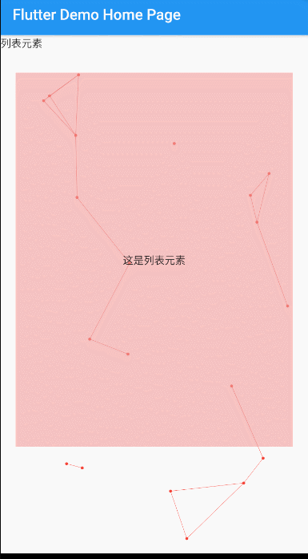

# flutter_particle_bg

[](https://pub.dartlang.org/packages/flutter_particle_bg)


The page implements the particle background effect(页面实现粒子背景效果)



## Usage

```
  Widget build(BuildContext context) {
    return Scaffold(
        appBar: AppBar(
          title: Text(widget.title),
        ),
        body: MooooooBackground(
          child: ListView(
            children: [
              Text('列表元素'),
              Container(
                height: 500,
                color: Colors.red[200].withOpacity(0.6),
                margin: EdgeInsets.fromLTRB(20, 30, 20, 30),
                alignment: Alignment.center,
                child: Text('这是列表元素'),
              )
            ],
          ),
        ));
  }
```
